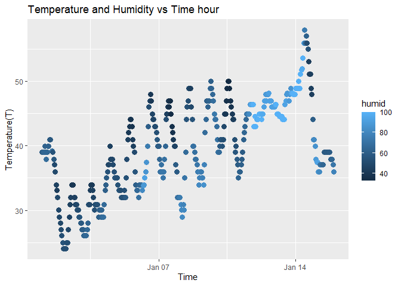

p8105_hw1_zq2227.Rmd
================
Zixuan Qiu zq2227
9/20/2023

# Homework1

## Problem 1

Load the moderndive library and the early_january_weather dataset

``` r
library(moderndive)
```

``` r
data("early_january_weather")
```

### Write a short description of the dataset;

``` r
help("early_january_weather")
```

    ## starting httpd help server ... done

``` r
summary(early_january_weather)
```

    ##     origin               year          month        day              hour      
    ##  Length:358         Min.   :2013   Min.   :1   Min.   : 1.000   Min.   : 0.00  
    ##  Class :character   1st Qu.:2013   1st Qu.:1   1st Qu.: 4.000   1st Qu.: 6.00  
    ##  Mode  :character   Median :2013   Median :1   Median : 8.000   Median :11.50  
    ##                     Mean   :2013   Mean   :1   Mean   : 8.039   Mean   :11.53  
    ##                     3rd Qu.:2013   3rd Qu.:1   3rd Qu.:12.000   3rd Qu.:17.75  
    ##                     Max.   :2013   Max.   :1   Max.   :15.000   Max.   :23.00  
    ##                                                                                
    ##       temp            dewp           humid           wind_dir    
    ##  Min.   :24.08   Min.   : 8.96   Min.   : 32.86   Min.   :  0.0  
    ##  1st Qu.:33.98   1st Qu.:19.94   1st Qu.: 51.34   1st Qu.:140.0  
    ##  Median :39.02   Median :26.06   Median : 61.67   Median :240.0  
    ##  Mean   :39.58   Mean   :28.06   Mean   : 65.48   Mean   :208.2  
    ##  3rd Qu.:44.96   3rd Qu.:35.06   3rd Qu.: 78.68   3rd Qu.:290.0  
    ##  Max.   :57.92   Max.   :53.06   Max.   :100.00   Max.   :360.0  
    ##                                                   NA's   :5      
    ##    wind_speed       wind_gust         precip            pressure   
    ##  Min.   : 0.000   Min.   :16.11   Min.   :0.000000   Min.   :1011  
    ##  1st Qu.: 5.754   1st Qu.:19.56   1st Qu.:0.000000   1st Qu.:1018  
    ##  Median : 8.055   Median :21.86   Median :0.000000   Median :1022  
    ##  Mean   : 8.226   Mean   :22.53   Mean   :0.002039   Mean   :1023  
    ##  3rd Qu.:11.508   3rd Qu.:25.32   3rd Qu.:0.000000   3rd Qu.:1027  
    ##  Max.   :24.166   Max.   :31.07   Max.   :0.190000   Max.   :1034  
    ##                   NA's   :308                        NA's   :38    
    ##      visib          time_hour                     
    ##  Min.   : 0.120   Min.   :2013-01-01 01:00:00.00  
    ##  1st Qu.: 9.000   1st Qu.:2013-01-04 19:15:00.00  
    ##  Median :10.000   Median :2013-01-08 12:30:00.00  
    ##  Mean   : 8.515   Mean   :2013-01-08 12:28:09.39  
    ##  3rd Qu.:10.000   3rd Qu.:2013-01-12 05:45:00.00  
    ##  Max.   :10.000   Max.   :2013-01-15 23:00:00.00  
    ## 

``` r
names(early_january_weather)
```

    ##  [1] "origin"     "year"       "month"      "day"        "hour"      
    ##  [6] "temp"       "dewp"       "humid"      "wind_dir"   "wind_speed"
    ## [11] "wind_gust"  "precip"     "pressure"   "visib"      "time_hour"

``` r
str(early_january_weather)
```

    ## tibble [358 × 15] (S3: tbl_df/tbl/data.frame)
    ##  $ origin    : chr [1:358] "EWR" "EWR" "EWR" "EWR" ...
    ##  $ year      : int [1:358] 2013 2013 2013 2013 2013 2013 2013 2013 2013 2013 ...
    ##  $ month     : int [1:358] 1 1 1 1 1 1 1 1 1 1 ...
    ##  $ day       : int [1:358] 1 1 1 1 1 1 1 1 1 1 ...
    ##  $ hour      : int [1:358] 1 2 3 4 5 6 7 8 9 10 ...
    ##  $ temp      : num [1:358] 39 39 39 39.9 39 ...
    ##  $ dewp      : num [1:358] 26.1 27 28 28 28 ...
    ##  $ humid     : num [1:358] 59.4 61.6 64.4 62.2 64.4 ...
    ##  $ wind_dir  : num [1:358] 270 250 240 250 260 240 240 250 260 260 ...
    ##  $ wind_speed: num [1:358] 10.36 8.06 11.51 12.66 12.66 ...
    ##  $ wind_gust : num [1:358] NA NA NA NA NA NA NA NA NA NA ...
    ##  $ precip    : num [1:358] 0 0 0 0 0 0 0 0 0 0 ...
    ##  $ pressure  : num [1:358] 1012 1012 1012 1012 1012 ...
    ##  $ visib     : num [1:358] 10 10 10 10 10 10 10 10 10 10 ...
    ##  $ time_hour : POSIXct[1:358], format: "2013-01-01 01:00:00" "2013-01-01 02:00:00" ...

``` r
nrow(early_january_weather)
```

    ## [1] 358

``` r
ncol(early_january_weather)
```

    ## [1] 15

``` r
mean(early_january_weather$temp)
```

    ## [1] 39.58212

##### This dataset is a hourly meterological data collection that form the LGA, JFK and EWR on January 2013. This data frame has 15 varibales that is origin, year, month, day, hour, temp, dewp, humid, wind_dir, wind_speed,wind_gust,precip,pressure,visib and time_hour.

- 15 variables include the 1 character data(origin)that represent the
  data location. 4 integer variables that represent the time of data
  collected. 9 numeric variables that represent the meteorological data.
  And 1 POSIXct time object represent the specific date and time,  
- The size of the data set: 358 rows and 15 columns.
- The mean temperature of the data set is the 39.58212F.
- Important variables
  - The temperature range:\[24.08,57.92\]in F. Mean:39.58F. Median:
    39.02F.
  - Relative humidity \[32.86,100.00 \]. Mean: 65.48%. Median: 61.67%
  - Wind_speed range \[0,24.166MPH\]. Mean: 8.226MPH. Median: 8.055MPH.
    The wind direction are in degrees.
  - Pressure:Sea level pressure in millibars. Median:1022. Mean:1023
  - Visibility in miles \[0.120,10.000\]. Mean:8.515. Media:10.000

### Plot

``` r
library(tidyverse)
```

    ## ── Attaching core tidyverse packages ──────────────────────── tidyverse 2.0.0 ──
    ## ✔ dplyr     1.1.3     ✔ readr     2.1.4
    ## ✔ forcats   1.0.0     ✔ stringr   1.5.0
    ## ✔ ggplot2   3.4.3     ✔ tibble    3.2.1
    ## ✔ lubridate 1.9.2     ✔ tidyr     1.3.0
    ## ✔ purrr     1.0.2     
    ## ── Conflicts ────────────────────────────────────────── tidyverse_conflicts() ──
    ## ✖ dplyr::filter() masks stats::filter()
    ## ✖ dplyr::lag()    masks stats::lag()
    ## ℹ Use the conflicted package (<http://conflicted.r-lib.org/>) to force all conflicts to become errors

``` r
ggplot(early_january_weather, aes(x =time_hour,y= temp, color= humid)) + geom_point(size=3) +
labs(title= "Temperature and Humidity vs Time hour", y="Temperature(T)", x="Time")
```

<!-- -->

#### Description

#### From the graph, it can be concluded that the temperature shows sharp fluctuations in a short time interval but gradually increases over time. The short-term temperature changes are due to the alternation of day and night, while the overall rise in temperature is due to the warming climate as January progresses. The relatively humidity is indicated by the color of the points, and the overall relative humidity also gradually increases with time. The humidity in mid-January is noticeably higher than that at the beginning of January.

``` r
plot1 <-ggplot(early_january_weather, aes(x =time_hour,y= temp, color= humid)) + geom_point(size=3) +
labs(title= "Temperature and Humidity vs Time hour", y="Temperature(T)", x="Time")
```

``` r
ggsave("problem 1 Temp vs time plot.png", plot=plot1)
```

    ## Saving 7 x 5 in image

## Pronlem 2
